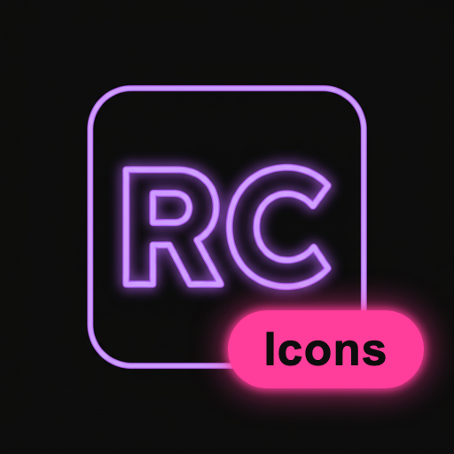

<div align="center">



<h1>Real Coder Icons</h1>

<p><em>Neon icon theme for Visual Studio Code — with first-class NeoObjectPascal (<code>.npas</code>) support.</em></p>

</div>

## About

**Real Coder Icons** is a vibrant, neon-accented file & folder icon theme for VS Code,
built to pair with the [RealCoder](https://marketplace.visualstudio.com/) color theme.

It ships dedicated icons for the **NeoObjectPascal** language:

| File | Icon |
|------|------|
| `*.npas` | RC neon monogram |
| `*.test.npas` | RC monogram with a test badge |

> **Credits.** Real Coder Icons is a fork **inspired by** the excellent
> [Material Icon Theme](https://github.com/material-extensions/vscode-material-icon-theme)
> by Philipp Kief / Material Extensions (MIT). The original icon set and generator
> architecture are theirs; this fork rebrands the extension and adds NeoObjectPascal
> icons. The upstream license is preserved in [`LICENSE`](./LICENSE).

## Install

1. Open the Extensions view (`Cmd/Ctrl+Shift+X`).
2. Search for **Real Coder Icons** and install.
3. Run **`Real Coder Icons: Activate Icon Theme`** from the Command Palette
   (`Cmd/Ctrl+Shift+P`), or pick it via **File → Preferences → File Icon Theme**.

## Build from source

The icon manifest is generated from the TypeScript config in `src/`:

```bash
npm install
npm run build   # → dist/realcoder-icons.json
```

Add or change file associations in `src/core/icons/fileIcons.ts`, drop SVGs in
`icons/`, then rebuild.

## Commands

All commands are available under the **Real Coder Icons:** prefix — activate the
theme, toggle icon packs, change folder/file colors, adjust opacity/saturation,
toggle explorer arrows, and restore defaults.

## License

[MIT](./LICENSE) — copyright retained for the upstream Material Icon Theme project,
as required by its license. This fork's rebrand and additions are provided under
the same MIT terms.
