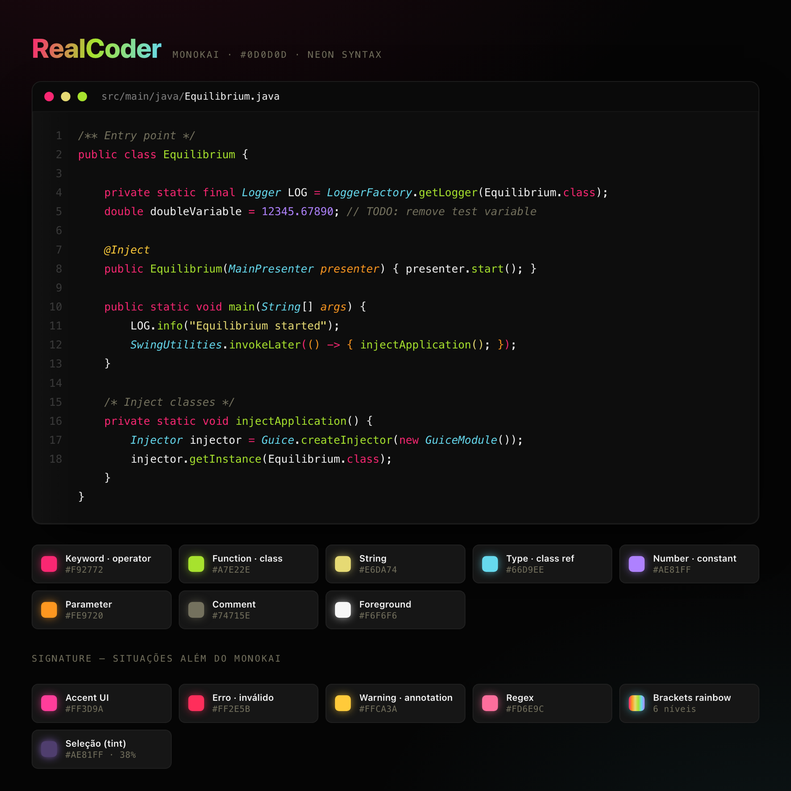

# RealCoder for [Visual Studio Code](http://code.visualstudio.com)

> A Monokai-inspired dark theme for [Visual Studio Code](http://code.visualstudio.com) — pure black background and intense neon syntax colors.



## Palette

| Role | Color |
|------|-------|
| Background | `#0D0D0D` |
| Foreground | `#F6F6F6` |
| Keyword / operator | `#F92772` |
| Function / class name | `#A7E22E` |
| String | `#E6DA74` |
| Type / class | `#66D9EE` |
| Number / constant | `#AE81FF` |
| Function parameter | `#FE9720` |
| Comment | `#74715E` |

## Install

See [INSTALL.md](INSTALL.md) for full instructions.

Once installed, select **RealCoder** from `File -> Preferences -> Color Theme`.

## Build

The theme JSON is generated from a single source of truth (`src/realcoder.yml`):

```bash
npm install
npm run build
```

This writes `theme/realcoder.json`, which is the file the extension ships.

## License

[MIT](LICENSE)
